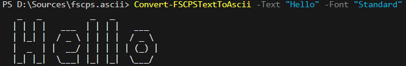
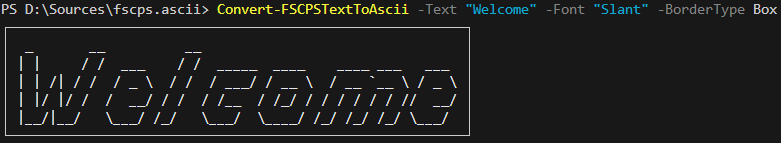
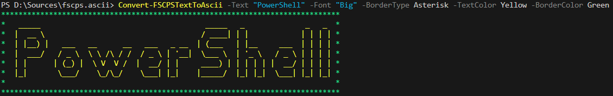
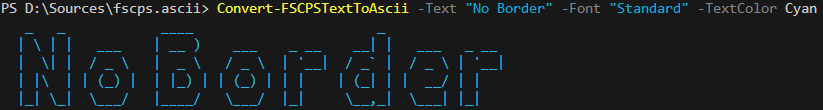
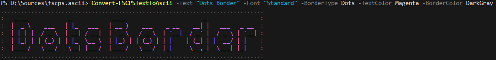
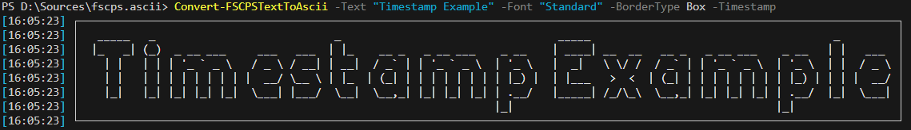

# 🌟 **fscps.ascii**

A PowerShell module to handle work with ASCII.

## 🛠️ Getting started
#### Install the latest module
```PowerShell
Install-Module -Name fscps.ascii
```

#### Install without administrator privileges
```PowerShell
Install-Module -Name fscps.ascii -Scope CurrentUser
```
#### List all available commands / functions

```PowerShell
Get-Command -Module fscps.ascii
```

#### Update the module

```PowerShell
Update-Module -name fscps.ascii
```

#### Update the module - force

```PowerShell
Update-Module -name fscps.ascii -Force
```


## 📁 Available functions

### Convert-FSCPSTextToAscii

### Description
The `Convert-FSCPSTextToAscii` function is a PowerShell utility that converts a given text into ASCII art using a specified font. It also supports optional border styles and customizable colors for both the text and the border. This function is ideal for creating visually appealing text banners or decorations in scripts, logs, or console outputs.

### Parameters

#### `-Text`
- **Description**: Specifies the text to be converted into ASCII art.
- **Type**: `string`
- **Required**: Yes

#### `-Font`
- **Description**: Specifies the font to be used for generating the ASCII art.
- **Type**: `string`
- **Required**: Yes

#### `-BorderType`
- **Description**: Defines the type of border to apply around the ASCII art.
- **Type**: `BorderType` (Enum)
- **Required**: No
- **Default Value**: `None`

#### `-TextColor`
- **Description**: Sets the color for the ASCII art text.
- **Type**: `string`
- **Required**: No
- **Default Value**: `White`
- **Allowed Values**: 
  - `Black`
  - `DarkBlue`
  - `DarkGreen`
  - `DarkCyan`
  - `DarkRed`
  - `DarkMagenta`
  - `DarkYellow`
  - `Gray`
  - `DarkGray`
  - `Blue`
  - `Green`
  - `Cyan`
  - `Red`
  - `Magenta`
  - `Yellow`
  - `White`

#### `-BorderColor`
- **Description**: Sets the color for the border around the ASCII art.
- **Type**: `string`
- **Required**: No
- **Default Value**: `Gray`
- **Allowed Values**: 
  - `Black`
  - `DarkBlue`
  - `DarkGreen`
  - `DarkCyan`
  - `DarkRed`
  - `DarkMagenta`
  - `DarkYellow`
  - `Gray`
  - `DarkGray`
  - `Blue`
  - `Green`
  - `Cyan`
  - `Red`
  - `Magenta`
  - `Yellow`
  - `White`

#### `-Timestamp`
- **Description**: A switch to include a timestamp in the output.
- **Type**: `switch`
- **Required**: No
- **Default Value**: `$false`

#### `-VerticalLayout`
- **Description**: Specifies the vertical layout type for the ASCII art.
- **Type**: `LayoutType` (Enum)
- **Required**: No
- **Default Value**: `Default`

#### `-HorizontalLayout`
- **Description**: Specifies the horizontal layout type for the ASCII art.
- **Type**: `LayoutType` (Enum)
- **Required**: No
- **Default Value**: `Default`

#### `-ShowHardBlanks`
- **Description**: A switch to display hard blanks in the ASCII art.
- **Type**: `switch`
- **Required**: No
- **Default Value**: `$false`

#### `-WhitespaceBreak`
- **Description**: A switch to enable breaking lines at whitespace.
- **Type**: `switch`
- **Required**: No
- **Default Value**: `$false`

#### `-ScreenWigth`
- **Description**: The maximum width of the screen for rendering the ASCII art.
- **Type**: `int`
- **Required**: No
- **Default Value**: `100`

#### `-Padding`
- **Description**: The padding to apply to the ASCII art. Defaults to `0`. 
- **Type**: `int`
- **Required**: No
- **Default Value**: `0`     

#### `-PrintDirection`
- **Description**: A switch to specify the print direction of the ASCII art.
- **Type**: `switch`
- **Required**: No
- **Default Value**: `$false` (left-to-right)

#### `-OutputColorVariable`
- **Description**: The name of the variable to store the ASCII art with color formatting.
- **Type**: `string`
- **Required**: No

#### `-OutputNoColorVariable`
- **Description**: The name of the variable to store the ASCII art without color formatting.
- **Type**: `string`
- **Required**: No

## 📚 Examples

### Example 1: Basic ASCII Art
- **Description**:  Converts the text "Hello" into ASCII art using the "Standard" font without any border or color customization.
```powershell
Convert-FSCPSTextToAscii -Text "Hello" -Font "Standard"
```
- **Output**:



### Example 2: ASCII Art with Border
- **Description**: Converts the text "Welcome" into ASCII art using the "Slant" font and surrounds it with a box border.
```powershell
Convert-FSCPSTextToAscii -Text "Welcome" -Font "Slant" -BorderType Box
```
- **Output**:



### Example 3: ASCII Art with Custom Colors
- **Description**: Converts the text "PowerShell" into ASCII art using the "Big" font, surrounds it with an asterisk border, and applies yellow text with a green border.
```powershell
Convert-FSCPSTextToAscii -Text "PowerShell" -Font "Big" -BorderType Asterisk -TextColor Yellow -BorderColor Green
```
- **Output**:



### Example 4: ASCII Art with No Border and Custom Text Color
- **Description**: Converts the text "No Border" into ASCII art using the "Standard" font with cyan-colored text and no border.
```powershell
Convert-FSCPSTextToAscii -Text "No Border" -Font "Standard" -TextColor Cyan
```
- **Output**:



### Example 5: ASCII Art with Dots Border
- **Description**: Converts the text "Dots Border" into ASCII art using the "Standard" font, surrounds it with a dots border, and applies magenta text with a dark gray border.
```powershell
Convert-FSCPSTextToAscii -Text "Dots Border" -Font "Standard" -BorderType Dots -TextColor Magenta -BorderColor DarkGray
```
- **Output**:



### Example 6: ASCII Art with Timestamp
- **Description**: Converts the text "Timestamp Example" into ASCII art using the "Standard" font, surrounds it with a box border, and enables detailed information (timestamp) in the output.
```powershell
Convert-FSCPSTextToAscii -Text "Timestamp Example" -Font "Standard" -BorderType Box -Timestamp
```
- **Output**:



### 🚀 All fonts examples [here](/font_examples.md) !!!

### Requirements
- PowerShell 5.1 or later  
- `PSFramework` module (if used for additional functionality)

### 🤝 License
This script is provided under the MIT License. Feel free to use and modify it as needed.